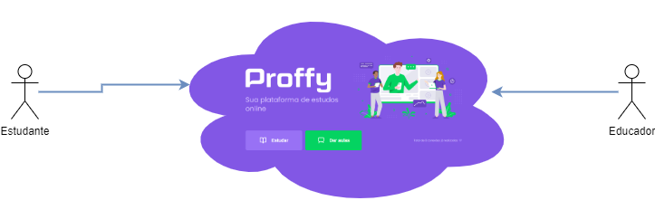
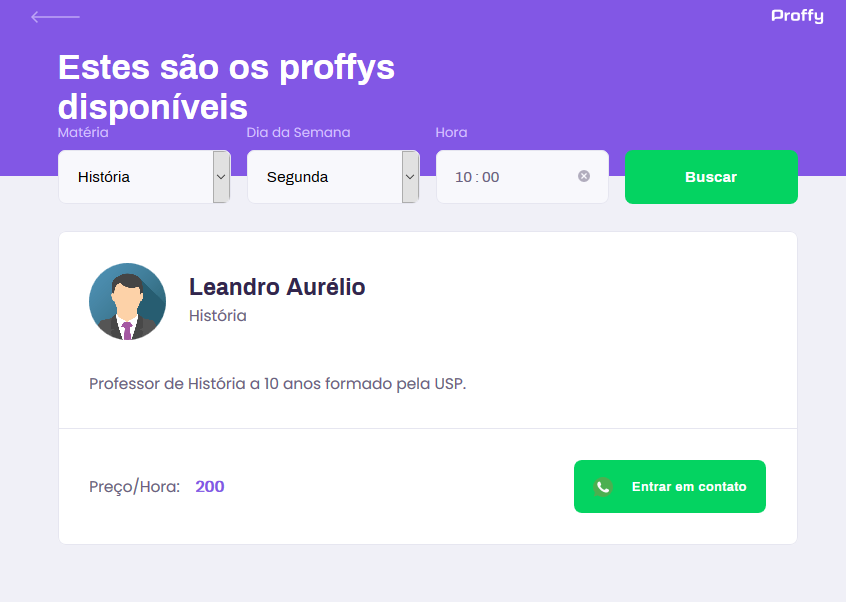
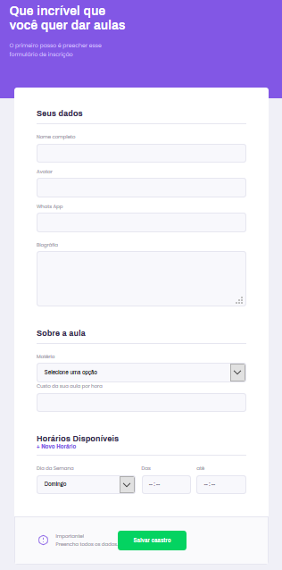

# Projeto Proffy

## Descrição Resumida

Este repositório faz parte do projeto Proffy, desenvolvido durante a <a href="https://nextlevelweek.com/inscricao/2/" target="_blank">Next Level Week #2</a> promovida pela <a href="https://rocketseat.com.br" target="_blank">RocketSeat</a>.

**Nota**

A "Next Level Week" é um conjunto de aulas práticas em vídeo em que é desenvolvido um projeto.
As aulas são divididas em sub-conjuntos denominados "trilhas". A trilha desse projeto é a "Omnistack".

## Detalhes do projeto

### Ideia Principal

Plataforma onde estudantes podem encontrar professores para obterem aulas particulares. A plataforma irá atuar como uma ponte entre professores e estudantes.



### Stakeholders

* **Educador(a) ou Professor(a):** Profissional que oferece aulas particulares usando o sistema.
* **Estudante:** Pessoa que busca por aulas particulares usando o sistema.

**Nota**

*Stakeholders* são sistemas ou pessoas afetadas pelo sistema desenvolvido.

### Funcionalidades

#### Estudante

* Buscar aulas

#### Professor(a)

* Cadastrar aulas

### Telas

Landing Page - Home - Página Inicial


Página de Busca



Página de Cadastro de aulas



**Nota**

O Layout das telas do site e aplicativo são semelhantes.

## Links Externos

* RocketSeat: [https://rocketseat.com.br](https://rocketseat.com.br)

* Site Oficial "Next Level Week #2": [https://nextlevelweek.com/](https://nextlevelweek.com/)

## Este Repositório

Este repositório contém a API REST do projeto. A API é responsável por fornecer e atualizar os dados das aulas. É usado o formato json para o tráfego de informações.

### Transações

#### *Total de conexões*

Rota: \<url\>/connections  
Método: GET  
Resposta:  

```json
{
  "total": 0
}
```

#### *Criar de conexão*

Rota: \<url\>/connections     
Método: POST  
Dados para serem enviados:

```json
{
	"user_id":0
}
```

#### *Listar Aulas conforme critérios de busca*

Rota: \<url\>/classes     
Método: GET  
Rota com parâmetros QueryString: \<url\>/classes?week_day=1&subject=Fisica&time=9:00  
Resposta:

```json
{
	[
        {
        "id": 1,
        "subject": "Biologia",
        "cost": 80,
        "userId": 1,
        "name": "Nome",
        "avatar": "https://site/avatar.png",
        "whatsapp": "9999999999999",
        "bio": "Biografia"
        }
    ]
}
```

**Valores para o parâmetro *week_day***

Valor|Dia da semana
-----|------------
0|Domingo
1|Segunda
2|Terça
3|Quarta
4|Quinta
5|Sexta
6|Sábado

**Nota**

Caso nenhuma aula seja localizada com os critérios de busca enviados com o uso dos parâmetros *QueryString*, o código http 404 é retornado.

#### *Cadastrar Aulas*

Rota: \<url\>/classes     
Método: POST  
Dados para serem enviados:

```json
{
	"name"	: "Nome",
	"avatar": "http://dominio/img_avatar.png",
	"whatsapp":"11977777777",
	"bio":"Biografia",
	"subject":"Biologia",
	"cost":90,
	"schedule": [
		{"week_day":1, "from":"08:00", "to":"12:00"},
		{"week_day":3, "from":"10:00", "to":"18:00"},
		{"week_day":4, "from":"08:00", "to":"12:00"}
	]
}
```

## Demais Repositórios do projeto

* Aplicativo para celular: 
[https://github.com/fbnnd1/nlw2-proffy-mobile](https://github.com/fbnnd1/nlw2-proffy-mobile)

* Site: 
[https://github.com/fbnnd1/nlw2-proffy-web](https://github.com/fbnnd1/nlw2-proffy-web)